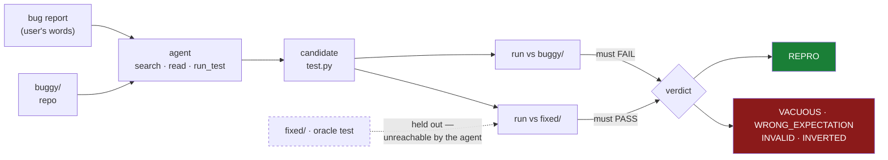

# regressgen

**Turn a bug report into a regression test that provably reproduces the bug.**

An agent reads a plain-English bug report and an unfamiliar Python repository,
then writes a pytest test that **fails on the broken code and passes once the bug
is fixed**. Both halves are checked mechanically, so "it works" is not an opinion.

<!-- BEGIN:headline -->
| | baseline | shipped agent |
|---|---|---|
| regression tests that actually reproduce the bug | 80% | **91%** |
| tests that silently pass on broken code | 1.7 | **0.0** |
| cost per test | $0.08 | $0.22 |

44 real bugs from 7 upstream libraries, mean of 3 runs each. Paired exact McNemar: p = 0.00661.
<!-- END:headline -->

Verify the ground truth yourself — no API key, no model calls, no cost, about
15 minutes (it runs pytest four times per case):

```bash
uv sync && uv run regressgen validate
```

---

## The problem

### Who has it

A developer who has just been handed a bug report for code they did not write.
Most often: a maintainer triaging an issue, or someone picking up a ticket in an
unfamiliar part of a large codebase.

### The bottleneck

The disciplined move is to write a failing test *before* fixing anything. Almost
nobody does, and the reason is not laziness — it is that the failing test is the
expensive part.

To write it you must find the relevant code in a codebase you may not know,
work out what the correct behaviour *should* be (the report tells you what went
wrong, rarely what "right" looks like precisely enough to assert), and then get a
test to fail for the right reason. A test that fails because you guessed a
function signature wrong looks identical, in the terminal, to one that fails
because you found the bug.

So the test gets skipped, the fix goes in unguarded, and the bug comes back.
The regression test is the only durable artifact of the whole exercise — the fix
protects you today, the test protects you in eighteen months.

### Why an agent should help, and why it usually doesn't

This looks like an ideal LLM task: read text, write a small file. Ask a model
directly and it produces something that looks exactly right. The failure is
invisible without execution — the test passes on the broken code, or it fails for
a reason that has nothing to do with the bug. You cannot tell by reading it.

That is what makes this worth measuring rather than eyeballing.

---

## What it does

```bash
uv run regressgen solve --repo ~/code/mylib --report bug.md --out tests/test_issue_412.py
```

The agent explores the repository, forms a hypothesis about what correct
behaviour should be, writes a test, runs it against your code, and checks that it
failed for the *right* reason rather than because of a mistyped name. It prints
the test, whether it currently fails, and its rationale, then waits for you to
review.

Pass `--variant v5-fixprobe` and it will additionally patch the bug in a scratch
copy to show you the fix its test implies. That costs about 60% more and,
measurably, produces no better test — but the hypothesis is something a reviewer
can check, which is worth something when a human is reading the output anyway.

**A human still owns the judgement call.** The agent asserts what it believes
correct behaviour to be. Confirming that is what a reviewer is for, and the CLI
says so before it writes anything.

---

## How it is measured

### The two-sided gate

Every generated test is run against two trees:

| | test must | why |
|---|---|---|
| `buggy/` | **FAIL** | otherwise it does not catch the bug |
| `fixed/` | **PASS** | otherwise it does not describe correct behaviour |

The agent sees only `buggy/`. `fixed/` is held out, and the tools cannot reach it
— path confinement, not a polite instruction.



This pair is what makes the metric un-gameable. Consider the two obvious cheats:

- `assert False` — fails on buggy, also fails on fixed. Scores zero.
- a test of behaviour that already works — passes on both. Scores zero.

Only a test that pins down the **correct** expected behaviour satisfies both.

Every outcome falls into exactly one bucket, and the buckets are diagnostic:

| Verdict | buggy | fixed | Meaning |
|---|---|---|---|
| **REPRO** | fail | pass | success — a real regression test |
| VACUOUS | pass | pass | does not exercise the bug at all |
| WRONG_EXPECTATION | fail | fail | asserts the wrong correct-behaviour |
| INVALID | — | — | will not even import or collect |
| INVERTED | pass | fail | describes the bug as the desired behaviour |
| LEAKED | — | — | tried to read the held-out answer |
| ERROR | — | — | harness or API failure — **excluded from the rate**, never counted against the agent |

**Primary metric: repro rate** — the share of cases reaching REPRO.

### The corpus

<!-- BEGIN:corpussummary -->
**44 cases**, each a real bug fixed by a real maintainer in a real library, drawn from 7 upstream projects (attrs, boltons, more-itertools, tabulate, cachetools, packaging, semver).
<!-- END:corpussummary -->

Cases are mined by script, not hand-picked, and each is admitted only if four
invariants hold:

| | existing suite | maintainer's regression test |
|---|---|---|
| `buggy/` | **I1** green | **I3** fails |
| `fixed/` | **I2** green | **I4** passes |

I1 and I2 are the important ones: the existing suite is green on **both** sides,
so the bug ships undetected and cannot be found by running the tests that are
already there. The agent must construct a new input that exposes it.

Re-prove all four yourself in about two minutes, no model calls, no cost:

```bash
uv run regressgen validate
```

Full detail, provenance and licensing: [docs/CORPUS.md](docs/CORPUS.md).

---

## Results

<!-- BEGIN:scoreboard -->
| System | Repro rate | Range | Runs | Silent failures | $/case | s/case |
|---|---:|---:|---:|---:|---:|---:|
| Baseline (one prompt, no tools) | **35.3/44  (80%)** | 77–82% | 3 | 1.7 | $0.078 | 20 |
| v4  + right-reason check | **40.0/44  (91%)** | 89–93% | 3 | 0.0 | $0.215 | 49 |

Repro rate is the mean over all stored runs of that system; *Range* is the lowest and highest single run. *Silent failures* are tests that pass when run against the buggy code (VACUOUS + INVERTED) — a developer runs pytest, sees green, and commits believing they have coverage they do not have. Every other failure mode is loud.

*$/case* is what `claude-agent-sdk` reports as `total_cost_usd`: the value of the tokens consumed at Anthropic API list prices. It is a usage measurement, not an invoice — running this against a Claude subscription draws on that plan's quota rather than billing the amount shown.
<!-- END:scoreboard -->

Failure modes, most recent run of each system:

<!-- BEGIN:verdicts -->
| System (most recent run) | Repro | Vacuous | Wrong Expectation | Invalid | Inverted | Leaked | Error |
|---|---:|---:|---:|---:|---:|---:|---:|
| Baseline (one prompt, no tools) | 36 | 1 | 5 | 2 | 0 | 0 | 0 |
| v4  + right-reason check | 41 | 0 | 3 | 0 | 0 | 0 | 0 |
<!-- END:verdicts -->

<details>
<summary><strong>Per-case verdicts</strong> (most recent run of each system) — click to expand</summary>

<!-- BEGIN:percase -->
| Case | baseline | v4-discipline |
|---|---|---|
| `attrs-09161fc9` | **PASS** | **PASS** |
| `attrs-6fda0a4e` | **PASS** | **PASS** |
| `attrs-937b1e23` | **PASS** | **PASS** |
| `attrs-97f8d175` | **PASS** | **PASS** |
| `attrs-a71fbbad` | wrong_expectation | **PASS** |
| `attrs-af9c5109` | **PASS** | **PASS** |
| `attrs-c9150d27` | wrong_expectation | **PASS** |
| `attrs-ce89f5d1` | **PASS** | **PASS** |
| `attrs-f9ff9135` | vacuous | wrong_expectation |
| `boltons-1e61524a` | **PASS** | **PASS** |
| `boltons-55dfe507` | **PASS** | **PASS** |
| `boltons-609cabe9` | **PASS** | **PASS** |
| `boltons-c1c25da3` | invalid | **PASS** |
| `boltons-d0a284fc` | **PASS** | **PASS** |
| `boltons-ead236e2` | **PASS** | **PASS** |
| `boltons-eb659013` | **PASS** | **PASS** |
| `boltons-ebc7a8f7` | **PASS** | **PASS** |
| `boltons-f1034b07` | **PASS** | **PASS** |
| `cachetools-57d2e481` | invalid | **PASS** |
| `cachetools-bb4b37cf` | **PASS** | **PASS** |
| `cachetools-c0fdf6ab` | **PASS** | **PASS** |
| `cachetools-d3598664` | **PASS** | **PASS** |
| `more-itertools-073d2342` | **PASS** | **PASS** |
| `more-itertools-0e6acdf9` | **PASS** | **PASS** |
| `more-itertools-428a0a2c` | **PASS** | **PASS** |
| `more-itertools-958990e2` | **PASS** | **PASS** |
| `more-itertools-b0aa91ef` | **PASS** | **PASS** |
| `more-itertools-d64a7d69` | **PASS** | **PASS** |
| `more-itertools-d992be0d` | **PASS** | **PASS** |
| `more-itertools-edb3346f` | **PASS** | **PASS** |
| `more-itertools-f51a53bf` | **PASS** | **PASS** |
| `packaging-524b701c` | **PASS** | **PASS** |
| `packaging-a716c52b` | **PASS** | **PASS** |
| `packaging-c52d2b30` | **PASS** | **PASS** |
| `semver-4b03f867` | **PASS** | **PASS** |
| `semver-bc41390f` | wrong_expectation | wrong_expectation |
| `tabulate-0655054b` | **PASS** | **PASS** |
| `tabulate-0978de5b` | wrong_expectation | **PASS** |
| `tabulate-20c6370d` | wrong_expectation | **PASS** |
| `tabulate-5373ebfa` | **PASS** | **PASS** |
| `tabulate-6c48142c` | **PASS** | **PASS** |
| `tabulate-87a9a4e0` | **PASS** | **PASS** |
| `tabulate-b1ed1fda` | **PASS** | **PASS** |
| `tabulate-d29909b4` | **PASS** | wrong_expectation |
<!-- END:percase -->

</details>

### A note on "human time per task"

The suggested metric table asks for human time. We do not report a number for it,
because we did not measure one, and an estimate would be the one figure in this
document not backed by evidence.

What we can say precisely is *where* the human time goes, and the corpus measures
that directly. A developer using the baseline cannot tell a good test from a bad
one by reading it — that is the entire premise of the problem. In real life there
is no `fixed/` tree to check against, so the only way to know is to fix the bug
and re-run, which is the work the test was supposed to precede.

So the honest framing is a burden, not a duration:

| per run of 44 cases | baseline | shipped agent |
|---|---:|---:|
| tests that are wrong and **look** wrong (loud) — repair by hand | 6.0 | 4.0 |
| tests that are wrong and **look right** (silent) | **1.7** | **0.0** |
| tests that will not even import | 1.0 | 0.0 |
| cost per task | $0.08 | $0.22 |
| wall time per task | 20s | 49s |

The silent row is the one that matters, and it is the row where the gap is
total rather than incremental. A loud failure costs a developer minutes: the
test is red, they look at it, they fix it. A silent one costs them the
regression coverage they believe they have, and they find out eighteen months
later when the bug comes back. Across three runs of 44 cases the agent produced
**zero** of those; the baseline averaged 1.7 per run and never fewer than one.

If you want a wall-clock number, `tools/human_timing.py` runs the timing exercise
we would have run with more hours: it presents n cases, times you writing a test
for each, and scores your tests through the same gate the agents face.

### How much is a single run worth?

Less than we assumed. Two runs of the *same* system on the *same* cases disagree
on a meaningful fraction of individual verdicts, because the model is not
deterministic. That is why every system here is run more than once and reported
as a mean over runs, and why the changelog does not treat a one-case delta as a
result.

<!-- BEGIN:stability -->
| System | Runs | Verdicts agreeing between consecutive runs | Agreement |
|---|---:|---:|---:|
| Baseline (one prompt, no tools) | 3 | 77/88 | 88% |
| v4  + right-reason check | 3 | 84/88 | 95% |

Same system, same cases, independent runs. A rung-to-rung delta smaller than this disagreement rate is not evidence.
<!-- END:stability -->

### Is the gap real?

Systems are run on the same cases, so the comparison is paired and only cases
where two systems *disagree* carry information. `regressgen report` prints an
exact McNemar test for every adjacent pair and for the headline comparison.

<!-- BEGIN:significance -->
- **Headline** — baseline vs v4-discipline: 19 fixed, 5 broken, 24 discordant of 132 paired observations over 3 paired run(s). Exact McNemar p = 0.00661 (significant at p<0.05).

- baseline vs v4-discipline: 19 fixed, 5 broken, 24 discordant of 132 paired observations over 3 paired run(s). Exact McNemar p = 0.00661 (significant at p<0.05).
<!-- END:significance -->

**Exploratory, then confirmatory.** This is a two-stage design, and the two
stages should be read differently.

*Exploratory* — the full six-rung ladder, run once each on a 17-case corpus.
This is where the hypotheses came from: it is where execution feedback was found
to lower the score while eliminating silent failures, where the self-fix probe
was found to change nothing, and where the critic was found to endorse the
errors it was meant to catch. On that corpus the headline gap reached p = 0.07 —
suggestive, not significant. Those runs are in `results/_exploratory-17case/`.

*Confirmatory* — the corpus was expanded to 44 cases and the **headline pair**
(baseline versus the shipped agent) re-run three times each. Three runs, not one,
because the exploratory stage also revealed how unstable a single run is. This
stage tests one claim only: that the agent beats the baseline. It is the number
to trust.

The intermediate rungs were not re-run on the expanded corpus. They cost roughly
as much again as the confirmatory stage and their job — generating the hypotheses
above — was already done. Where the changelog reports a rung's delta, it says
which corpus it came from, and single-run deltas of one or two cases are called
what they are: inside the noise.

**How noisy is a single case?** The exploratory 17 are a subset of the full
corpus, so re-running every system gives a free reliability estimate: same
system, same cases, two independent runs weeks apart in wall-clock terms and
completely independent in sampling. `tools/analyze.py` prints the verdict
agreement between the two runs. Read a rung's delta against that agreement rate
— anything smaller is not evidence, and the changelog says where that applies.

Everything around the model is pinned: `uv.lock`, Python 3.12.13,
`PYTHONHASHSEED=0`, `TZ=UTC`, a scrubbed subprocess environment, and
`-o addopts=` so no upstream pytest config leaks into the sandbox. The model
itself is not deterministic, and no amount of pinning changes that.

---

## Improvement changelog

Every rung adds exactly one thing to the previous one and is measured with the
same gate, so a delta is attributable to a single change.

The **Evidence** column says which corpus each number came from. Rungs marked
*(exploratory, 17 cases, single run)* generated the hypotheses; the final row is
the confirmatory measurement — 44 cases, three runs each. Read single-run deltas
of one or two cases as noise, not result; the stability table above says how much
noise there is.

Deeper analysis of the interesting rungs: [docs/FINDINGS.md](docs/FINDINGS.md).

| Stage | What was tried, and why | Evidence | Decision |
|---|---|---|---|
| **Corpus audit A** | First-draft bug reports were generated from the maintainer's fix and read like test specifications; one even named the internal method and the missing check. | Baseline **14/17** on the 17-case corpus — the task had become transcription, not engineering. | **Rewrote the corpus.** Reports re-drafted in a user's voice, symptom-level, with an automated leak gate that rejects private identifiers, touched filenames, dunders in prose, and causal phrasing. Baseline fell to **9/17**. Old drafts kept as `cases/*/report_v1_precise.md`. |
| **Corpus audit B** | Noticed the baseline's inlined source was capped at 24k chars. For 11 of 17 cases the real file is larger — `more.py` is 172k — so the baseline was reading the first 11% and never reaching the function. | Raising the cap left the score at **9/17** but moved INVALID 3→1 and WRONG_EXPECTATION 3→5. | **Kept the fix.** The score was unchanged, but truncation had been converting "wrong idea about correct behaviour" into "could not import", which would have overstated the agent's elimination of INVALID. |
| **Baseline** | One direct prompt, no tools: the bug report plus the whole source file the real fix touched — more than the agent gets, deliberately. | **9/17 (53%)**, 2 silent failures, $0.11/case <br>*(exploratory: 17 cases, single run)* | The starting point. Its dominant failure is WRONG_EXPECTATION (5): fluent, plausible tests that assert the wrong thing. |
| **v2 — repo navigation** | Give the agent `list_files`, `search_code`, ranged `read_file`. Hypothesis: most failures come from guessing APIs rather than reading them. | **14/17 (82%)**, +5. INVALID 1→0. <br>*(exploratory: 17 cases, single run)* | **Kept — the single largest gain in the project.** Simply letting the model read the real implementation beat every subsequent piece of machinery combined. |
| **v3 — execution** | Add `run_test` so the agent runs its candidate against the buggy code and reads real pytest output. Expected the largest win of all. | **13/17 (76%), −1.** Two REPRO cases regressed to WRONG_EXPECTATION. But silent failures went **1→0**. <br>*(exploratory: 17 cases, single run)* | **Kept, despite the lower headline.** The agent optimised the half of the goal it could observe: it saw `FAILED`, and stopped. What execution actually bought was the elimination of silent failures — tests that pass on broken code. See [FINDINGS §1](docs/FINDINGS.md). |
| **v4 — right-reason check** | Tell the agent, in words, that a failure caused by a wrong name, wrong signature, or invented detail is worthless, and to read the failure before believing it. Aimed directly at v3's regression. | **15/17 (88%), +2** — recovering *exactly* the two cases v3 broke. <br>*(exploratory: 17 cases, single run)* | **Kept.** Cheapest rung in the project: no new tool, ~150 words of instruction. |
| **v5 — hypothetical-fix probe** | The agent cannot see the fixed tree, so it cannot check the second half of the gate. `try_fix` lets it patch the bug itself in a scratch copy and run its own test against the patched code — reconstructing the hidden half from the half it may see. The tool we had most confidence in. | **15/17 — identical to v4. Not one case changed verdict.** Cost +59%, wall time +43%. Used in 17/17 cases, 30 probes, 10 reporting "still fails" — so it was genuinely exercised, not ignored. <br>*(exploratory: 17 cases, single run)* | **Removed from the default path** (kept as opt-in for `solve`). On both remaining failures the agent invented a patch that made its own wrong expectation true, and the probe answered "your test PASSES with this fix". It verifies that the agent's test and the agent's patch agree — written by the same reasoning, from the same misunderstanding. See [FINDINGS §2](docs/FINDINGS.md#2-self-verification-is-a-mirror-not-an-oracle). |
| **v6 — adversarial critic** | A fresh-context reviewer, read-only, asked one question: "once this bug is fixed, will this test pass?" If it objects, the agent gets one revision round. The orchestration answer to §2 — if self-verification cannot escape the agent's frame, can a second agent? | **15/17, and the same verdict on every single case as v4 — zero differences.** 2.3× the cost, 2.7× the wall time. The critic ran on all 17, endorsed **both** wrong tests and caught neither. <br>*(exploratory: 17 cases, single run)* | **Removed.** A fresh context is not fresh priors. On `semver-bc41390f` it traced the bug correctly, cited the mechanism, and then approved a test that fails against the real fix. See [FINDINGS §3](docs/FINDINGS.md#3-an-independent-reviewer-that-shares-your-priors-is-not-independent). |
| **Final — confirmatory** | v4 shipped: navigation + execution + the right-reason instruction. Re-measured on the expanded 44-case corpus, three runs of the baseline and three of v4, to test the one claim that matters. | **80% → 91%** (baseline 35.3/44, range 77–82%; v4 40.0/44, range 89–93%). Silent failures **1.7 → 0.0**, uncollectable tests **1.0 → 0.0**. Paired exact McNemar over 3 run-pairs: 19 fixed, 5 broken, **p = 0.0066**. <br>*(confirmatory: 44 cases, 3 runs each)* | **This is the result.** The same comparison on a single run gives p = 0.23 — not significant. The repeats are what make it a measurement. v4 is also the *steadier* system: 95% run-to-run verdict agreement against the baseline's 88%. |

---

## How the agent is built

Everything runs through `claude-agent-sdk` against the local Claude Code login,
so no API key is required to reproduce it.

### Tools

Custom in-process MCP tools rather than generic file access, for three reasons:
every path is confined to `buggy/` so the answer key is unreachable by
construction; every call is recorded, which is what the trajectories are made
from; and `run_test` / `try_fix` need semantics no generic tool provides.

| Tool | Purpose | In the default (v4)? |
|---|---|---|
| `list_files` | repository layout | yes |
| `read_file` | ranged reads; files over 400 lines return a definition outline first | yes |
| `search_code` | regex across the tree | yes |
| `run_test` | run a candidate against the buggy code, return raw pytest output | yes |
| `submit_test` | final answer | yes |
| `try_fix` | apply a hypothetical patch in a scratch copy, check the test passes, then discard | **no — measured, removed** |

`read_file` returning an outline for large files is not a detail: the first
version returned whole files, and the agent read a 172k-character module three
times in one case. Ranged reads halved cost per case and made the trajectories
legible. That change was made before the ladder was run, so every rung has it —
it is a tool-quality fix, not a scored iteration.

### Isolation

Every test run — the agent's, the oracle's, the existing suite's — happens in a
throwaway copy of the tree, never in `cases/` itself. A generated test that
writes files, mutates global state, or leaves a cache behind cannot affect the
next run or contaminate the committed corpus. Subprocesses get a scrubbed
environment (`PYTHONHASHSEED=0`, `TZ=UTC`, `LC_ALL=C.UTF-8`, a minimal `PATH`)
and `-o addopts=` so no upstream pytest config leaks in, which is what makes
runs comparable across the seven libraries.

`try_fix` is the only tool that modifies source, and it does so in a scratch
copy that is deleted when the call returns. Nothing the agent does reaches the
user's working tree; `solve` prints its test and writes to disk only when you
pass `--out`.

Output is redacted for machine-specific paths before it is stored, so `results/`
and `trajectories/` are portable and diffable rather than full of one laptop's
home directory.

### The instructions

Agent instructions live in [`regressgen/agent/prompts.py`](regressgen/agent/prompts.py)
as separate blocks, composed per variant. Each changelog rung adds exactly one
block, so a measured delta is attributable to one change rather than a rewrite.

The baseline and every variant are told the same success criterion. Withholding
the goal from the baseline would inflate the result.

---

## The main failure mode

Once the agent can read the repository, essentially every remaining failure is
the same one: **WRONG_EXPECTATION** — a well-formed test, correctly targeted at
the reported bug, asserting a plausible but wrong idea of what correct behaviour
should be. It fails on the buggy code, which looks like success, and fails on the
fixed code, which is where you find out.

It is the hardest failure to catch because it is indistinguishable from success
from inside the agent. The test is legible, the reasoning is sound, the bug is
the right bug. Only the expectation is wrong.

`semver-bc41390f` is the clean example, and no system at any rung solves it.
A subclass comparison is asymmetric; every system asserted that both directions
should succeed and agree. The maintainer instead left `compare()` asymmetric and
fixed only the equality protocol, so `==` became symmetric through Python's
`NotImplemented` fallback. That is a design decision. It is not deducible from
the report, because it was never in the report.
[Full analysis](docs/FINDINGS.md#5-the-challenging-case-when-the-report-cannot-determine-the-answer).

## What this does not show

- **Python, and a particular kind of Python.** The corpus is seven pure-Python,
  dependency-light libraries, chosen so the evaluation runs offline and
  deterministically. Nothing here says how the agent behaves on a Django
  monolith, a repo with fixtures and a database, or a language with a slower
  feedback loop. `solve` runs tests under your project's own interpreter for
  exactly this reason, but it is untested at that scale.

- **The bug reports are written, not scraped.** They are drafted from the
  maintainer's regression test and passed through a mechanical leak gate, for
  the reasons in [docs/CORPUS.md](docs/CORPUS.md). Real issue threads are more
  authentic and far more uneven. 21 of the 44 cases link to their upstream
  thread so you can judge the substitution yourself.

- **Only the headline pair was repeated.** Baseline and the shipped agent were
  run three times each on the full corpus. The intermediate rungs were run once
  on the smaller exploratory corpus, and single-run deltas there are inside the
  noise — which is why those findings rest on mechanisms visible in the
  trajectories rather than on their scores.

- **One model, one day.** Everything is Claude Sonnet 5 through
  `claude-agent-sdk`. Whether the verification findings hold for other models,
  or for the same model given more turns, is not tested.

- **There is a ceiling this cannot cross.** When a report admits more than one
  defensible notion of correct behaviour, no amount of agent capability picks
  the right one — the information is not in the report.
  [FINDINGS §5](docs/FINDINGS.md#5-the-challenging-case-when-the-report-cannot-determine-the-answer)
  works through the case where every system fails for that reason. That is the
  argument for the human checkpoint, not a defect to engineer away.

## Hot take

**Verification that lives inside the agent's own reasoning raises its confidence
without raising its accuracy — and the two are easy to confuse, because both feel
like progress.**

I built three verification mechanisms for this agent. None did what I expected.

`run_test` certifies only half the success criterion, because the fixed tree is
held out. The agent optimised the half it could see: it wrote a test, saw
`FAILED`, and stopped. Score went *down*.

`try_fix` was the fix for that — let the agent patch the bug itself and check its
test goes green, reconstructing the hidden half. It was used in every case, it
pushed back a third of the time, and it changed **zero** verdicts while costing
59% more. On the cases it got wrong, the agent wrote a patch that made its own
wrong expectation true, and the probe replied "your test PASSES with this fix".
It verifies that the agent's test and the agent's patch agree — both written by
the same reasoning, from the same misunderstanding, minutes apart.

`v6` was the orchestration answer: a separate reviewer agent, fresh context,
read-only, asked only whether the test would pass once the bug was fixed. It
analysed every case, cost 2.3× as much — and returned the identical verdict on
every one of the 17 cases. Not the same total. The same answers.

It endorsed both of the wrong tests and caught neither. On `semver-bc41390f` it
went and traced the comparison logic, found the real mechanism, wrote it down
correctly — and approved a test that fails against the actual fix. Understanding
the bug did not help, because the thing it got wrong was not the bug, it was the
guess about what the fix *should* do, and it makes the same guess the first agent
makes. A fresh context is not fresh priors.

The rung that actually worked was the cheapest thing in the project: about 150
words telling the agent what its verifier could not see, and that a failure for
the wrong reason is worth nothing.

**What I would do differently next time.** Three things, in order of how much
they cost me.

*Run everything more than once before believing it.* Three clean runs of the
same baseline on the same 44 cases agree on only 88% of individual verdicts —
roughly one case in eight flips with nothing changing but the sampling. Every
rung delta in the ladder is one or two cases wide, which puts all of them inside
that band. The findings survive because each rests on a *mechanism* visible in a
trajectory, not on its score. Had I been relying on scores alone I would have
been reporting coin flips, and I would never have known.
[FINDINGS §4](docs/FINDINGS.md#4-a-single-run-is-not-a-measurement).

*Ask what fraction of the success criterion a verifier can observe, and whether
its signal comes from outside the agent's own reasoning.* If it does not, expect
it to harden mistakes rather than catch them, and spend the budget on telling
the agent what the signal is blind to instead.

*Measure failure modes, not just the headline.* Execution feedback looked like a
regression on repro rate while eliminating every silent failure. Scoring on one
number would have thrown away the change that fixed the most dangerous failure
mode.

---

## CLI

| Command | What it does |
|---|---|
| `regressgen validate` | re-prove the four corpus invariants. No model calls, no cost. Start here. |
| `regressgen list` | list the cases |
| `regressgen show <case> [--spoil]` | one case in full: provenance, bug report, and optionally the held-out oracle |
| `regressgen run --system <s>` | run a system over the corpus and score it |
| `regressgen report` | scoreboard, per-case grid, and paired significance tests |
| `regressgen solve --repo … --report …` | **the product** — generate a regression test for your own repository |

---

## Reproduction

[REPRODUCTION.md](REPRODUCTION.md) — clean-environment setup, exact commands for
the solution, the baseline and the evaluation, expected output, versions,
runtime and cost.

## Agent trajectories

For each system and case: the exact instructions, every tool call and what the
tool returned, the retries those responses caused, the submitted test, and both
halves of the gate.

- [`trajectories/confirmatory/`](trajectories/confirmatory/) — the 44-case runs
  of the baseline and the shipped agent
- [`trajectories/exploratory/`](trajectories/exploratory/) — the 17-case ladder,
  including the v2-versus-v3 pair that the execution-feedback finding rests on

Each directory has its own index with a short "where to start" list.

```bash
uv run python tools/export_trajectories.py --label confirmatory
uv run python tools/export_trajectories.py \
  --results-dir results/_exploratory-17case --label exploratory
```

## What existed before, and what is new

Pre-existing: the six upstream libraries (their own licences, vendored
unmodified), Claude Code and `claude-agent-sdk`, pytest, uv.

Written for this hackathon, all of it in one session:

- `tools/mine_cases.py` — the corpus miner, its four-invariant validation, and
  its circuit breaker for libraries whose suites will not run
- `tools/write_reports.py` — the bug-report generator and its mechanical leak
  gate, with regeneration on violation
- `regressgen/verify.py` — the two-sided gate and its verdict taxonomy
- `regressgen/sandbox.py` — throwaway-copy execution, output redaction, and a
  pluggable interpreter so `solve` works on repos with dependencies
- `regressgen/agent/` — the tools, the layered instructions, and all six systems
- `regressgen/runner.py`, `report.py` — parallel evaluation, scoring, exact
  McNemar significance, harness-error isolation
- `regressgen/cli.py` — `validate`, `list`, `show`, `run`, `report`, `solve`
- `tools/` — trajectory export, changelog analysis, critic analysis, case
  timing, link checking, README table injection, human-timing harness
- `tests/` — 16 tests, including the ones that prove the gate rejects
  `assert False`, vacuous tests, inverted tests, and answer-key peeking
- all documentation in this repository

Numbers in this README are generated from `results/` by
`tools/update_readme.py`. None are typed by hand.
